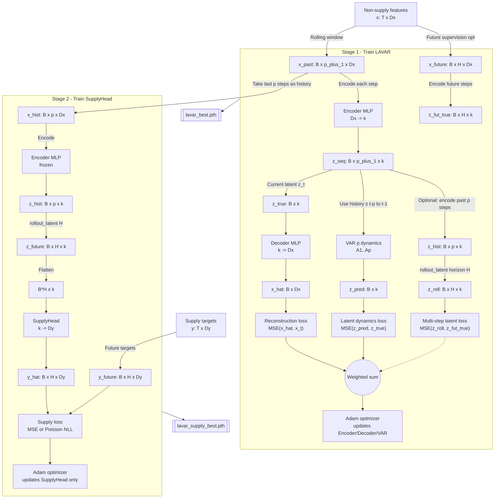

# LAVAR (Latent Autoencoder VAR) + Supply Head

This module trains a **two-stage** model:

- **Stage 1**: Learn a latent state \(z_t\) from non-supply features \(x_t\) with an autoencoder, while enforcing **linear VAR(p)** dynamics in latent space.
- **Stage 2**: Freeze the learned latent model and train a **SupplyHead** to predict future supplies \(y_{t+1:t+H}\) from rolled-out future latents.

## System diagram (Mermaid)

## Code map

- `dataset.py`: `RollingXYDataset` produces `(x_past, x_future, y_future)` rolling windows.
- `models.py`:
  - `LAVAR`: encoder/decoder + `VARDynamics`
  - `LAVARWithSupply`: latent rollout + `SupplyModel` head
- `dynamics.py`: `VARDynamics` implements linear VAR(p) in latent space.
- `train_stage1.py`: optimizes reconstruction + latent dynamics (+ optional multi-step latent supervision).
- `train_stage2.py`: freezes `lavar` and trains only `supply_head`.

